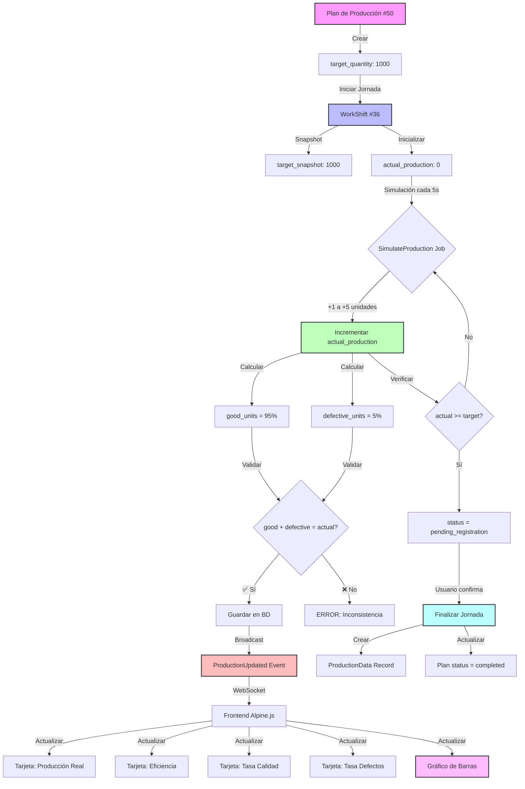

# Diagrama de Flujo: Sistema de Producción en Tiempo Real

## 📊 Métricas Calculadas

### 1. Eficiencia de Producción
```
Eficiencia = (Producción Real / Producción Planificada) × 100

Ejemplo:
- Producción Planificada: 1000 unidades
- Producción Real: 950 unidades
- Eficiencia: (950 / 1000) × 100 = 95%
```

### 2. Tasa de Calidad
```
Tasa de Calidad = (Unidades Buenas / Producción Real) × 100

Ejemplo:
- Producción Real: 950 unidades
- Unidades Buenas: 903 unidades
- Tasa de Calidad: (903 / 950) × 100 = 95.05%
```

### 3. Tasa de Defectos
```
Tasa de Defectos = (Unidades Defectuosas / Producción Real) × 100

Ejemplo:
- Producción Real: 950 unidades
- Unidades Defectuosas: 47 unidades
- Tasa de Defectos: (47 / 950) × 100 = 4.95%
```

## 🔄 Ciclo de Actualización en Tiempo Real

```
┌──────────────────────────────────────────────────────────────────┐
│                    SIMULADOR DE PRODUCCIÓN                       │
│                      (cada 5 segundos)                           │
└──────────────────────────────────────────────────────────────────┘
                                │
                                ▼
┌──────────────────────────────────────────────────────────────────┐
│  1. Incremento Aleatorio: +1 a +5 unidades                       │
│  2. Calcular Buenas: 95% del total acumulado                     │
│  3. Calcular Defectuosas: total - buenas                         │
│  4. Validar: buenas + defectuosas = total                        │
└──────────────────────────────────────────────────────────────────┘
                                │
                                ▼
┌──────────────────────────────────────────────────────────────────┐
│                   GUARDAR EN BASE DE DATOS                       │
│                                                                  │
│  work_shifts:                                                    │
│    - actual_production (int)                                     │
│    - good_units (int)                                            │
│    - defective_units (int)                                       │
└──────────────────────────────────────────────────────────────────┘
                                │
                                ▼
┌──────────────────────────────────────────────────────────────────┐
│             BROADCAST (WebSocket - Laravel Echo)                 │
│                                                                  │
│  Canal: work-shift.{id}                                          │
│  Evento: production.updated                                      │
│  Datos: {                                                        │
│    actual_production,                                            │
│    good_units,                                                   │
│    defective_units,                                              │
│    production_efficiency,                                        │
│    quality_rate,                                                 │
│    defect_rate                                                   │
│  }                                                               │
└──────────────────────────────────────────────────────────────────┘
                                │
                                ▼
┌──────────────────────────────────────────────────────────────────┐
│              FRONTEND (Alpine.js + Chart.js)                     │
│                                                                  │
│  ┌─────────────────────────────────────────────────────────┐   │
│  │ Tarjeta 1: Producción Real                              │   │
│  │ 🔵 950 / 1000                                           │   │
│  └─────────────────────────────────────────────────────────┘   │
│                                                                  │
│  ┌─────────────────────────────────────────────────────────┐   │
│  │ Tarjeta 2: Eficiencia de Producción                     │   │
│  │ 🔵 95.0%                                                │   │
│  └─────────────────────────────────────────────────────────┘   │
│                                                                  │
│  ┌─────────────────────────────────────────────────────────┐   │
│  │ Tarjeta 3: Tasa de Calidad                              │   │
│  │ 🟢 95.1%                                                │   │
│  └─────────────────────────────────────────────────────────┘   │
│                                                                  │
│  ┌─────────────────────────────────────────────────────────┐   │
│  │ Tarjeta 4: Tasa de Defectos                             │   │
│  │ 🟢 4.9%                                                 │   │
│  └─────────────────────────────────────────────────────────┘   │
│                                                                  │
│  ┌─────────────────────────────────────────────────────────┐   │
│  │           GRÁFICO DE BARRAS                             │   │
│  │                                                         │   │
│  │  1000 │ █████████████████████████  Producción Planificada │
│  │   950 │ ████████████████████████   Producción Real     │   │
│  │   903 │ ███████████████████████    Unidades Buenas     │   │
│  │    47 │ ██                         Unidades Defectuosas│   │
│  └─────────────────────────────────────────────────────────┘   │
└──────────────────────────────────────────────────────────────────┘
```

## 🎨 Código de Colores de las Métricas

### Eficiencia de Producción
```
🟢 Verde  (≥100%):  Sobre cumplimiento - Excelente
🔵 Azul   (90-99%): Dentro del objetivo - Bueno
🟡 Amarillo (75-89%): Por debajo del objetivo - Aceptable
🔴 Rojo   (<75%):   Muy bajo - Requiere intervención
```

### Tasa de Calidad
```
🟢 Verde  (≥95%):  Calidad óptima
🟡 Amarillo (90-94%): Calidad aceptable
🔴 Rojo   (<90%):   Problemas de calidad
```

### Tasa de Defectos
```
🟢 Verde  (<5%):   Muy bueno
🟡 Amarillo (5-9%):  Aceptable
🔴 Rojo   (≥10%):   Requiere mejoras
```

## 📱 Captura de Pantalla (Mockup)

```
┌───────────────────────────────────────────────────────────────────┐
│                    ⏱️ Jornada #36        [▶️ Activo]              │
│                    Máquina CNC-001                                │
│                                                [Volver] [Finalizar]│
├───────────────────────────────────────────────────────────────────┤
│                                                                   │
│  ┌──────────┐  ┌──────────┐  ┌──────────┐  ┌──────────┐         │
│  │ 🔵 950   │  │ 🔵 95.0% │  │ 🟢 95.1% │  │ 🟢 4.9%  │         │
│  │ Producción│  │ Eficiencia│  │  Tasa de │  │  Tasa de │         │
│  │   Real   │  │ Producción│  │  Calidad │  │ Defectos │         │
│  │ de 1000  │  │ ▓▓▓▓▓▓▓░░│  │ 903 buenas│  │47 defectos│        │
│  └──────────┘  └──────────┘  └──────────┘  └──────────┘         │
│                                                                   │
│  ┌─────────────────────────────────────────────────────────────┐ │
│  │           Progreso de Producción                            │ │
│  │                                                             │ │
│  │  █████████████████████████  1000  Producción Planificada   │ │
│  │  ████████████████████████    950  Producción Real          │ │
│  │  ███████████████████████     903  Unidades Buenas          │ │
│  │  ██                           47  Unidades Defectuosas     │ │
│  │                                                             │ │
│  └─────────────────────────────────────────────────────────────┘ │
│                                                                   │
│  ┌─────────────────────────────────────────────────────────────┐ │
│  │ Información de la Jornada                                   │ │
│  │                                                             │ │
│  │ Equipo: CNC-001                Turno: 🌅 Mañana            │ │
│  │ Producto: Widget A             Plan: #50                   │ │
│  │ Operador: Juan Pérez           Inicio: 11/11 06:00         │ │
│  └─────────────────────────────────────────────────────────────┘ │
│                                                                   │
└───────────────────────────────────────────────────────────────────┘
```
